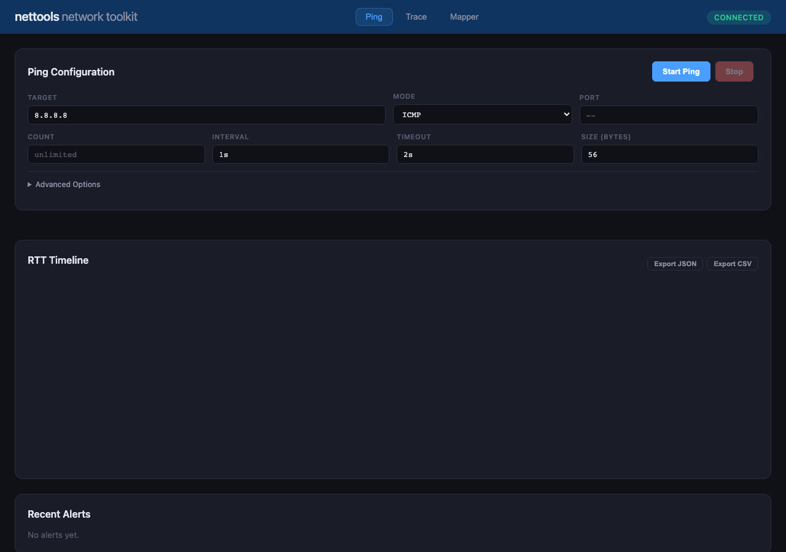
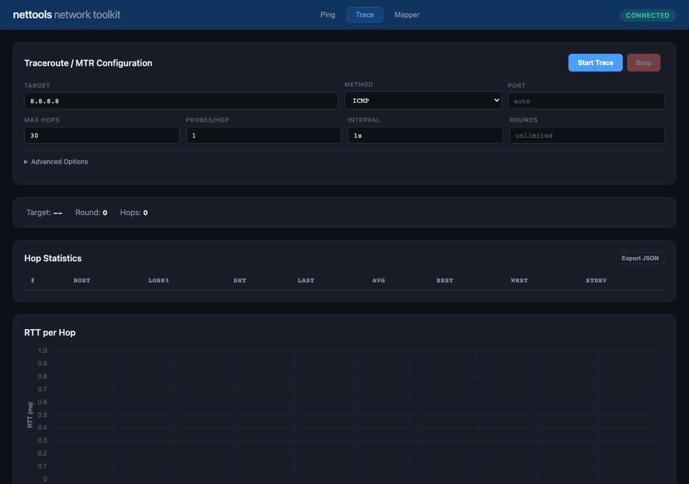
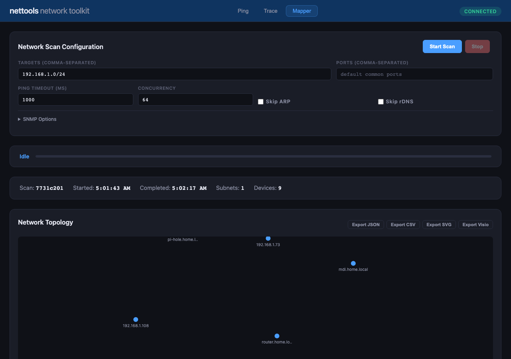
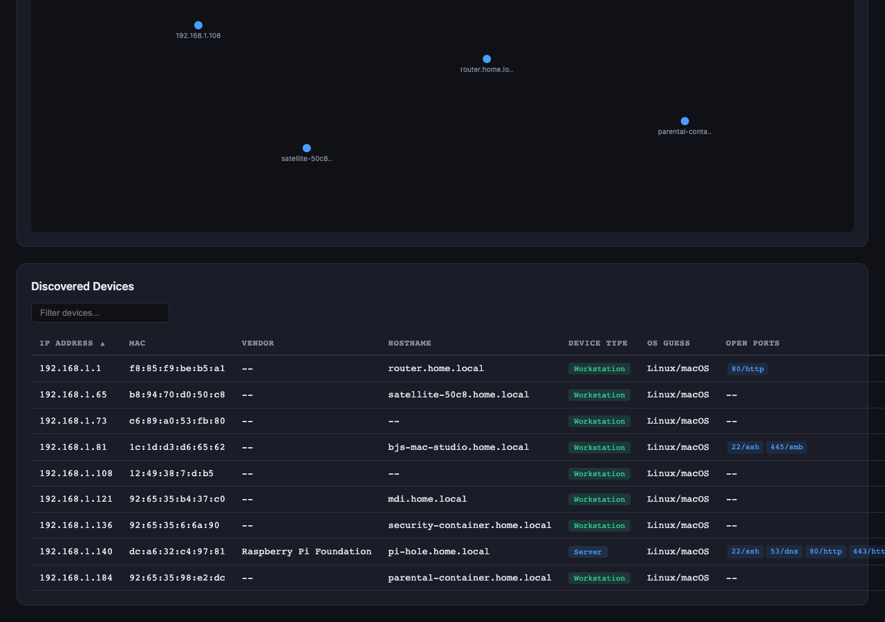

# nettools User Guide

**Version 0.1.0**

A unified network toolkit combining ping, traceroute, network mapping, and a real-time web dashboard into a single binary.

---

## Table of Contents

1. [Overview](#overview)
2. [Building from Source](#building-from-source)
   - [Prerequisites](#prerequisites)
   - [macOS](#macos)
   - [Linux](#linux)
   - [Windows](#windows)
   - [Release Build](#release-build)
3. [Privileges and Permissions](#privileges-and-permissions)
4. [Commands](#commands)
   - [ping](#ping)
   - [monitor](#monitor)
   - [trace](#trace)
   - [mtr](#mtr)
   - [scan](#scan)
   - [diff](#diff)
   - [schedule](#schedule)
   - [traps](#traps)
   - [export](#export)
   - [dashboard](#dashboard)
5. [Monitor Targets File](#monitor-targets-file)
6. [Web Dashboard](#web-dashboard)
   - [Launching the Dashboard](#launching-the-dashboard)
   - [Ping Tab](#ping-tab)
   - [Trace Tab](#trace-tab)
   - [Mapper Tab](#mapper-tab)
   - [Exporting Data](#exporting-data)
7. [Database Files](#database-files)
8. [Platform Support Matrix](#platform-support-matrix)
9. [Troubleshooting](#troubleshooting)

---

## Overview

`nettools` is a single Rust binary that provides:

- **Ping** — ICMP, TCP SYN, TCP Connect, and UDP ping with statistics, alerting, and logging
- **Monitor** — Multi-target live TUI dashboard with configurable alerts
- **Trace** — Classic traceroute with ICMP, UDP, and TCP probe methods
- **MTR** — Continuous traceroute with rolling per-hop statistics (like `mtr`)
- **Scan** — Network discovery with device fingerprinting, SNMP enrichment, and topology mapping
- **Diff** — Compare two network scans to detect changes
- **Schedule** — Automated recurring scans with optional web dashboard
- **Traps** — SNMP trap listener
- **Export** — Export stored ping, trace, and scan data to JSON, CSV, SVG, or Visio formats
- **Dashboard** — Unified web UI for running and monitoring all tools from a browser

All data is persisted in local SQLite databases, and the web dashboard streams results in real time via Server-Sent Events (SSE).

---

## Building from Source

### Prerequisites

All platforms require:

| Requirement       | Details                                              |
|-------------------|------------------------------------------------------|
| **Rust toolchain** | Edition 2021, version 1.70 or later recommended     |
| **C compiler**    | Required by the bundled SQLite (rusqlite)             |
| **Git**           | To clone the repository                               |

No external libraries (libpcap, npcap, etc.) are required. All dependencies are either pure-Rust or bundled.

Install Rust via [rustup](https://rustup.rs/):

```bash
curl --proto '=https' --tlsv1.2 -sSf https://sh.rustup.rs | sh
```

### macOS

macOS includes a C compiler via Xcode Command Line Tools. If you don't have it:

```bash
xcode-select --install
```

Clone and build:

```bash
git clone https://github.com/moocow5/nettools.git
cd nettools
cargo build
```

The binary will be at `target/debug/nettools`.

**Permissions:** ICMP ping and traceroute work without elevated privileges on macOS (unprivileged DGRAM sockets). TCP SYN ping requires `sudo`.

### Linux

Install build prerequisites:

```bash
# Debian / Ubuntu
sudo apt update
sudo apt install build-essential curl git

# Fedora / RHEL
sudo dnf groupinstall "Development Tools"
sudo dnf install curl git

# Arch
sudo pacman -S base-devel curl git
```

Clone and build:

```bash
git clone https://github.com/moocow5/nettools.git
cd nettools
cargo build
```

**Permissions:** Linux requires additional setup for ICMP sockets. See [Privileges and Permissions](#privileges-and-permissions).

### Windows

Install [Visual Studio Build Tools](https://visualstudio.microsoft.com/visual-studio-cpp-build-tools/) with the "Desktop development with C++" workload, or install the full Visual Studio Community edition.

Then in a terminal (PowerShell or Command Prompt):

```powershell
git clone https://github.com/moocow5/nettools.git
cd nettools
cargo build
```

**Note:** On Windows, only ICMP ping (via the Windows ICMP Helper API), network scanning, and the web dashboard are supported. Traceroute and TCP SYN ping are not available on Windows. See [Platform Support Matrix](#platform-support-matrix).

### Release Build

For optimized production binaries:

```bash
cargo build --release
```

The optimized binary will be at `target/release/nettools`. Release builds are significantly faster for network scanning and large-scale monitoring.

---

## Privileges and Permissions

Different features require different privilege levels depending on the platform:

| Feature               | macOS          | Linux                        | Windows        |
|-----------------------|----------------|------------------------------|----------------|
| ICMP ping             | No privileges  | Needs setup (see below)      | No privileges  |
| TCP Connect ping      | No privileges  | No privileges                | No privileges  |
| TCP SYN ping          | `sudo`         | `sudo` or `CAP_NET_RAW`     | Not supported  |
| UDP ping              | No privileges  | Needs setup (see below)      | Not supported  |
| Traceroute (ICMP)     | No privileges  | `sudo` or `CAP_NET_RAW`     | Not supported  |
| Traceroute (UDP/TCP)  | No privileges  | `sudo` or `CAP_NET_RAW`     | Not supported  |
| MTR                   | No privileges  | `sudo` or `CAP_NET_RAW`     | Not supported  |
| Network scan          | No privileges  | Needs setup (see below)      | No privileges  |
| SNMP trap listener    | `sudo` (port 162) | `sudo` (port 162)        | Admin (port 162) |

### Linux: Enabling Unprivileged ICMP

By default, Linux does not allow unprivileged users to create ICMP sockets. There are two approaches:

**Option A — Allow all users (recommended for development):**

```bash
sudo sysctl -w net.ipv4.ping_group_range="0 2147483647"
```

To make this permanent, add to `/etc/sysctl.conf`:

```
net.ipv4.ping_group_range = 0 2147483647
```

**Option B — Grant capabilities to the binary:**

```bash
sudo setcap cap_net_raw=ep ./target/release/nettools
```

This grants raw socket access to the specific binary without requiring `sudo` for every invocation.

---

## Commands

### ping

Send ICMP, TCP, or UDP pings to a target host with detailed statistics.

```
nettools ping <TARGET> [OPTIONS]
```

**Arguments:**

| Argument | Description |
|----------|-------------|
| `TARGET` | Hostname or IP address to ping |

**Options:**

| Flag | Short | Type | Default | Description |
|------|-------|------|---------|-------------|
| `--count` | `-c` | integer | unlimited | Number of pings to send |
| `--interval` | `-i` | duration | `1s` | Interval between pings |
| `--timeout` | `-W` | duration | `2s` | Timeout for each ping response |
| `--size` | `-s` | integer | `56` | Payload size in bytes |
| `--ttl` | `-t` | integer | OS default | IP Time-To-Live (1-255) |
| `--tos` | | integer | `0` | IP Type-of-Service / DSCP value (0-255) |
| `--mode` | `-m` | string | `icmp` | Ping mode: `icmp`, `tcp`, `tcp-connect`, `udp` |
| `--port` | `-p` | integer | | Port number for TCP/UDP modes |
| `--pattern` | | string | | Payload fill pattern: `zeros`, `alt`, `random`, or hex byte (e.g., `0xff`) |
| `--quiet` | `-q` | flag | | Quiet mode — only show summary |
| `--output` | `-o` | string | `text` | Output format: `text`, `json`, `csv` |
| `--log` | | path | | Append results to a log file |

**Duration format:** Values like `1s`, `500ms`, `2s`, `100ms` are supported.

**Examples:**

```bash
# Basic ICMP ping
nettools ping 8.8.8.8

# 10 pings at 500ms intervals
nettools ping 8.8.8.8 -c 10 -i 500ms

# TCP Connect ping to port 443
nettools ping google.com -m tcp-connect -p 443

# UDP ping with custom size
nettools ping 8.8.8.8 -m udp -p 53 -s 128

# ICMP ping with TTL and ToS, output as JSON
nettools ping 1.1.1.1 -t 64 --tos 46 -o json

# Log results to a file
nettools ping 8.8.8.8 --log ping_results.txt
```

### monitor

Launch a live TUI dashboard monitoring multiple targets simultaneously. Targets are defined in a TOML configuration file (see [Monitor Targets File](#monitor-targets-file)).

```
nettools monitor <TARGETS_FILE> [OPTIONS]
```

**Arguments:**

| Argument | Description |
|----------|-------------|
| `TARGETS_FILE` | Path to the TOML targets configuration file |

**Options:**

| Flag | Short | Type | Default | Description |
|------|-------|------|---------|-------------|
| `--interval` | `-i` | duration | | Override the ping interval for all targets |
| `--db` | | path | `nping.db` | SQLite database file for persistence |

**Examples:**

```bash
# Monitor targets defined in targets.toml
nettools monitor targets.toml

# Override interval to 2 seconds for all targets
nettools monitor targets.toml -i 2s

# Use a custom database location
nettools monitor targets.toml --db /var/lib/nettools/nping.db
```

### trace

Perform a one-shot traceroute to a destination, displaying each hop along the path.

```
nettools trace <TARGET> [OPTIONS]
```

**Arguments:**

| Argument | Description |
|----------|-------------|
| `TARGET` | Hostname or IP address to trace |

**Options:**

| Flag | Short | Type | Default | Description |
|------|-------|------|---------|-------------|
| `--method` | `-m` | string | `icmp` | Probe method: `icmp`, `udp`, `tcp` |
| `--first-ttl` | `-f` | integer | `1` | First TTL (starting hop) |
| `--max-ttl` | `-M` | integer | `30` | Maximum TTL (maximum hops) |
| `--queries` | `-q` | integer | `3` | Number of probes per hop |
| `--timeout` | `-w` | duration | `2s` | Timeout per probe |
| `--send-wait` | `-z` | duration | `50ms` | Delay between sending probes |
| `--packet-size` | `-s` | integer | `60` | Packet size in bytes (minimum 28) |
| `--port` | `-p` | integer | auto | Destination port for UDP/TCP probes |
| `--output` | `-o` | string | `text` | Output format: `text`, `json`, `csv` |

**Examples:**

```bash
# Standard ICMP traceroute
nettools trace 8.8.8.8

# TCP traceroute to port 443
nettools trace google.com -m tcp -p 443

# UDP traceroute with 5 probes per hop
nettools trace 1.1.1.1 -m udp -q 5

# JSON output, max 20 hops
nettools trace 8.8.8.8 -M 20 -o json
```

### mtr

Continuous traceroute with rolling statistics — combines traceroute and ping into a live, updating display. Similar to the `mtr` utility.

```
nettools mtr <TARGET> [OPTIONS]
```

**Arguments:**

| Argument | Description |
|----------|-------------|
| `TARGET` | Hostname or IP address to trace |

**Options:**

| Flag | Short | Type | Default | Description |
|------|-------|------|---------|-------------|
| `--method` | `-m` | string | `icmp` | Probe method: `icmp`, `udp`, `tcp` |
| `--interval` | `-i` | duration | `1s` | Interval between rounds |
| `--count` | `-c` | integer | unlimited | Number of rounds to run |
| `--max-ttl` | `-M` | integer | `30` | Maximum TTL (maximum hops) |
| `--queries` | `-q` | integer | `1` | Number of probes per hop per round |
| `--timeout` | `-w` | duration | `2s` | Timeout per probe |
| `--no-dns` | | flag | | Disable reverse DNS lookups |
| `--asn` | | flag | | Enable ASN (Autonomous System Number) lookups |
| `--geo` | | flag | | Enable GeoIP lookups |

**Examples:**

```bash
# Basic continuous traceroute
nettools mtr 8.8.8.8

# 50 rounds with ASN lookups
nettools mtr 8.8.8.8 -c 50 --asn

# Fast interval, no DNS
nettools mtr 1.1.1.1 -i 500ms --no-dns

# TCP MTR to port 443
nettools mtr google.com -m tcp -p 443
```

### scan

Discover devices on a network with port scanning, device fingerprinting, and optional SNMP enrichment.

```
nettools scan <TARGET>... [OPTIONS]
```

**Arguments:**

| Argument | Description |
|----------|-------------|
| `TARGET` | One or more targets — CIDR ranges, IP ranges, or individual IPs |

**Target formats:**
- CIDR notation: `192.168.1.0/24`
- IP range: `10.0.0.1-10.0.0.254`
- Single IP: `192.168.1.1`

**Options:**

| Flag | Short | Type | Default | Description |
|------|-------|------|---------|-------------|
| `--ports` | | list | common ports | Comma-separated list of ports to scan |
| `--ping-timeout` | | integer | `1000` | ICMP ping timeout in milliseconds |
| `--concurrency` | | integer | `64` | Maximum concurrent pings |
| `--no-arp` | | flag | | Skip ARP cache lookup |
| `--no-rdns` | | flag | | Skip reverse DNS lookups |
| `--snmp-community` | | string | | SNMPv2c community string (enables SNMP queries) |
| `--snmp-v3-user` | | string | | SNMPv3 username |
| `--snmp-v3-auth-proto` | | string | `none` | SNMPv3 auth protocol: `none`, `md5`, `sha1` |
| `--snmp-v3-auth-pass` | | string | | SNMPv3 authentication password |
| `--snmp-v3-priv-proto` | | string | `none` | SNMPv3 privacy protocol: `none`, `des`, `aes128` |
| `--snmp-v3-priv-pass` | | string | | SNMPv3 privacy password |
| `--output` | `-o` | string | `text` | Output format: `text`, `json`, `csv` |

**Examples:**

```bash
# Scan a /24 subnet
nettools scan 192.168.1.0/24

# Scan multiple subnets
nettools scan 192.168.1.0/24 10.0.0.0/24

# Scan with specific ports
nettools scan 192.168.1.0/24 --ports 22,80,443,8080

# Scan with SNMPv2c enrichment
nettools scan 192.168.1.0/24 --snmp-community public

# Scan with SNMPv3 (authPriv)
nettools scan 192.168.1.0/24 \
  --snmp-v3-user admin \
  --snmp-v3-auth-proto sha1 \
  --snmp-v3-auth-pass authpass123 \
  --snmp-v3-priv-proto aes128 \
  --snmp-v3-priv-pass privpass123

# JSON output with higher concurrency
nettools scan 10.0.0.0/16 --concurrency 256 -o json
```

### diff

Compare two network scans to detect new, removed, or changed devices.

```
nettools diff [OPTIONS]
```

**Options:**

| Flag | Short | Type | Default | Description |
|------|-------|------|---------|-------------|
| `--scan1` | | string | | First (older) scan ID |
| `--scan2` | | string | | Second (newer) scan ID |
| `--db` | | path | `nmapper.db` | Database path |
| `--output` | `-o` | string | `text` | Output format: `text`, `json` |

If `--scan1` and `--scan2` are omitted, the two most recent scans in the database are compared.

**Examples:**

```bash
# Compare the two most recent scans
nettools diff

# Compare specific scan IDs
nettools diff --scan1 abc123 --scan2 def456

# JSON output
nettools diff -o json
```

### schedule

Run network scans automatically on a recurring schedule. Results are persisted to the database and optionally displayed in a live web dashboard.

```
nettools schedule <TARGET>... [OPTIONS]
```

**Arguments:**

| Argument | Description |
|----------|-------------|
| `TARGET` | One or more scan targets (same formats as `scan`) |

**Options:**

| Flag | Short | Type | Default | Description |
|------|-------|------|---------|-------------|
| `--interval` | | integer | `60` | Scan interval in minutes |
| `--db` | | path | `nmapper.db` | Database path |
| `--ports` | | list | | Comma-separated list of ports to scan |
| `--ping-timeout` | | integer | `1000` | ICMP ping timeout in milliseconds |
| `--concurrency` | | integer | `64` | Maximum concurrent pings |
| `--no-arp` | | flag | | Skip ARP cache lookup |
| `--no-rdns` | | flag | | Skip reverse DNS lookups |
| `--snmp-community` | | string | | SNMPv2c community string |
| `--snmp-v3-user` | | string | | SNMPv3 username |
| `--snmp-v3-auth-proto` | | string | `none` | SNMPv3 auth protocol |
| `--snmp-v3-auth-pass` | | string | | SNMPv3 auth password |
| `--snmp-v3-priv-proto` | | string | `none` | SNMPv3 privacy protocol |
| `--snmp-v3-priv-pass` | | string | | SNMPv3 privacy password |
| `--dashboard` | | flag | | Launch web dashboard alongside scans |
| `--bind` | | string | `127.0.0.1:9092` | Dashboard bind address (with `--dashboard`) |

**Examples:**

```bash
# Scan every 30 minutes
nettools schedule 192.168.1.0/24 --interval 30

# Scan hourly with dashboard
nettools schedule 192.168.1.0/24 --interval 60 --dashboard

# Scan with SNMP, custom bind address for dashboard
nettools schedule 192.168.1.0/24 10.0.0.0/24 \
  --interval 15 \
  --snmp-community public \
  --dashboard --bind 0.0.0.0:9092
```

### traps

Listen for incoming SNMP traps. Displays trap events in real time.

```
nettools traps [OPTIONS]
```

**Options:**

| Flag | Short | Type | Default | Description |
|------|-------|------|---------|-------------|
| `--bind` | | string | `0.0.0.0:162` | Bind address for the trap listener |

**Note:** SNMP traps use UDP port 162, which is a privileged port. You will need `sudo` or equivalent permissions.

**Examples:**

```bash
# Listen on default port 162 (requires sudo)
sudo nettools traps

# Listen on a non-privileged port
nettools traps --bind 0.0.0.0:10162
```

### export

Export stored results from the database to various file formats.

#### export ping

Export stored ping monitoring results.

```
nettools export ping [OPTIONS]
```

| Flag | Short | Type | Default | Description |
|------|-------|------|---------|-------------|
| `--target` | | string | | Target host to export (omit to list available targets) |
| `--format` | `-f` | string | | Output format: `csv`, `json` |
| `--output` | `-o` | path | stdout | Output file path |
| `--from` | | string | | Start of time range (ISO 8601, e.g., `2026-03-16`) |
| `--to` | | string | | End of time range (ISO 8601) |
| `--limit` | `-n` | integer | | Maximum number of results |
| `--db` | | path | auto | SQLite database file |

**Examples:**

```bash
# List available targets
nettools export ping

# Export last 100 pings for a target as CSV
nettools export ping --target 8.8.8.8 -f csv -n 100

# Export to a file with time range
nettools export ping --target 8.8.8.8 -f json \
  --from 2026-03-01 --to 2026-03-18 -o ping_data.json
```

#### export trace

Export stored traceroute data.

```
nettools export trace [OPTIONS]
```

| Flag | Short | Type | Default | Description |
|------|-------|------|---------|-------------|
| `--target` | | string | | Filter by target host |
| `--format` | `-f` | string | `json` | Output format: `json`, `csv` |
| `--output` | `-o` | path | stdout | Output file path |
| `--trace-id` | | string | | Export a specific trace run by ID |
| `--limit` | | integer | `50` | Maximum number of trace runs |
| `--db` | | path | `ntrace.db` | Database file path |

**Examples:**

```bash
# Export latest traces as JSON
nettools export trace

# Export traces for a specific target
nettools export trace --target 8.8.8.8 -o traces.json

# Export a specific trace run
nettools export trace --trace-id abc123 -f csv -o trace.csv
```

#### export scan

Export network scan results to file.

```
nettools export scan [OPTIONS]
```

| Flag | Short | Type | Default | Description |
|------|-------|------|---------|-------------|
| `--format` | `-f` | string | required | Export format: `json`, `csv`, `svg`, `vsdx` |
| `--output` | `-o` | path | required | Output file path |
| `--db` | | path | `nmapper.db` | Database path |
| `--scan-id` | | string | latest | Scan ID to export |

**Examples:**

```bash
# Export latest scan as JSON
nettools export scan -f json -o scan.json

# Export as CSV
nettools export scan -f csv -o devices.csv

# Export topology as SVG
nettools export scan -f svg -o topology.svg

# Export topology as Visio (VSDX)
nettools export scan -f vsdx -o network.vsdx

# Export a specific scan
nettools export scan --scan-id abc123 -f json -o scan.json
```

### dashboard

Launch the unified web dashboard. This provides a browser-based interface for running and monitoring ping, traceroute, and network scans. See [Web Dashboard](#web-dashboard) for full details.

```
nettools dashboard [TARGETS_FILE] [OPTIONS]
```

**Arguments:**

| Argument | Description |
|----------|-------------|
| `TARGETS_FILE` | Optional path to a TOML targets file for background ping monitoring |

**Options:**

| Flag | Short | Type | Default | Description |
|------|-------|------|---------|-------------|
| `--bind` | `-b` | string | `127.0.0.1:9090` | Address to bind the web server |
| `--interval` | `-i` | duration | | Override ping interval for all targets |
| `--ping-db` | | path | `nping.db` | SQLite database for ping data |
| `--mapper-db` | | path | `nmapper.db` | SQLite database for scan data |

**Examples:**

```bash
# Launch dashboard (no background monitoring)
nettools dashboard

# Launch with background ping monitoring
nettools dashboard targets.toml

# Custom bind address (accessible from LAN)
nettools dashboard -b 0.0.0.0:8080

# Custom database locations
nettools dashboard targets.toml \
  --ping-db /var/lib/nettools/nping.db \
  --mapper-db /var/lib/nettools/nmapper.db
```

---

## Monitor Targets File

The monitor command and dashboard accept a TOML configuration file that defines which hosts to monitor. The file supports a global defaults section and per-target configuration with optional alert thresholds.

### Format

```toml
[global]
interval = "1s"           # Default interval for all targets

[[target]]
host = "8.8.8.8"          # Required: hostname or IP
label = "Google DNS"       # Optional: display label
mode = "icmp"              # Optional: icmp (default), tcp, tcp-connect, udp
port = 443                 # Optional: port for TCP/UDP modes
interval = "1s"            # Optional: per-target interval (overrides global)

[target.alert]             # Optional: alert thresholds
max_latency_ms = 100.0     # Alert if average latency exceeds this (ms)
max_jitter_ms = 50.0       # Alert if jitter exceeds this (ms)
max_loss_pct = 5.0         # Alert if packet loss exceeds this (%)
cooldown = "60s"           # Cooldown between repeated alerts
```

### Example targets.toml

```toml
[global]
interval = "1s"

[[target]]
host = "8.8.8.8"
label = "Google DNS"
mode = "icmp"
interval = "1s"

[target.alert]
max_latency_ms = 100.0
max_loss_pct = 5.0

[[target]]
host = "1.1.1.1"
label = "Cloudflare DNS"
mode = "icmp"

[[target]]
host = "google.com"
label = "Google"
mode = "tcp-connect"
port = 443
interval = "2s"

[[target]]
host = "cloudflare.com"
label = "Cloudflare"
mode = "tcp-connect"
port = 443
interval = "2s"

[[target]]
host = "9.9.9.9"
label = "Quad9 DNS"
mode = "icmp"
```

### Alert Fields

| Field | Type | Description |
|-------|------|-------------|
| `max_latency_ms` | float | Maximum acceptable average latency in milliseconds |
| `max_jitter_ms` | float | Maximum acceptable jitter in milliseconds |
| `max_loss_pct` | float | Maximum acceptable packet loss percentage (0.0-100.0) |
| `cooldown` | duration | Cooldown period between repeated alerts (default: `60s`) |

---

## Web Dashboard

The web dashboard provides a browser-based interface for configuring, running, and monitoring all three network tools. It features a dark theme, real-time updates via Server-Sent Events, and interactive visualizations.

### Launching the Dashboard

```bash
nettools dashboard
```

Then open your browser to **http://127.0.0.1:9090**.

To make the dashboard accessible from other machines on your network:

```bash
nettools dashboard -b 0.0.0.0:9090
```

The dashboard has three tabs: **Ping**, **Trace**, and **Mapper**.

### Ping Tab



The Ping tab provides a full-featured ping interface with real-time RTT charting.

**Configuration fields:**

| Field | Description | Default |
|-------|-------------|---------|
| Target | IP address or hostname | `8.8.8.8` |
| Mode | ICMP, TCP, TCP Connect, or UDP | ICMP |
| Port | Port number for TCP/UDP modes | |
| Count | Number of pings (leave empty for unlimited) | unlimited |
| Interval | Time between pings | `1s` |
| Timeout | Response timeout | `2s` |
| Size (bytes) | Payload size | `56` |

**Advanced Options** (click to expand):

| Field | Description |
|-------|-------------|
| TTL | IP Time-To-Live (1-255) |
| ToS/DSCP | Type of Service value (0-255) |
| Pattern | Payload fill: Default, Zeros, Alt Bits, Random |

**Controls:**
- **Start Ping** — Begins pinging with the configured parameters
- **Stop** — Stops the active ping session

**Display sections:**
- **Target Cards** — Shows per-target statistics: last RTT, average RTT, packet loss, jitter, MOS score
- **RTT Timeline** — Real-time line chart (Chart.js) showing RTT over time
- **Recent Alerts** — Displays alert notifications when thresholds are exceeded

**Export options:** JSON, CSV

### Trace Tab



The Trace tab runs a continuous traceroute (MTR-style) with rolling hop statistics.

**Configuration fields:**

| Field | Description | Default |
|-------|-------------|---------|
| Target | IP address or hostname | `8.8.8.8` |
| Method | ICMP, UDP, or TCP | ICMP |
| Port | Port number for UDP/TCP probes | auto |
| Max Hops | Maximum number of hops | `30` |
| Probes/Hop | Probes sent per hop per round | `1` |
| Interval | Time between rounds | `1s` |
| Rounds | Number of rounds (leave empty for unlimited) | unlimited |

**Advanced Options** (click to expand):

| Field | Description |
|-------|-------------|
| First TTL | Starting hop number (1-255) |
| Timeout | Timeout per probe |
| Send Wait | Delay between probes |
| Packet Size | Packet size in bytes (28-65500) |
| Disable DNS | Skip reverse DNS lookups |
| Enable ASN Lookup | Query ASN information for each hop |

**Controls:**
- **Start Trace** — Begins the continuous traceroute
- **Stop** — Stops the active trace

**Display sections:**
- **Info Bar** — Shows target, current round, and total hops discovered
- **Hop Statistics Table** — Per-hop table with columns: #, Host, Loss%, Snt, Last, Avg, Best, Wrst, StDev
- **RTT per Hop Chart** — Line chart showing RTT trends per hop across rounds

**Export options:** JSON

### Mapper Tab



The Mapper tab performs network discovery scans with device fingerprinting and topology visualization.

**Configuration fields:**

| Field | Description | Default |
|-------|-------------|---------|
| Targets | Comma-separated CIDR ranges | `192.168.1.0/24` |
| Ports | Comma-separated port list | default common ports |
| Ping Timeout (ms) | ICMP timeout in milliseconds | `1000` |
| Concurrency | Maximum concurrent pings | `64` |
| Skip ARP | Disable ARP cache lookup | unchecked |
| Skip rDNS | Disable reverse DNS lookups | unchecked |

**SNMP Options** (click to expand):

| Field | Description |
|-------|-------------|
| SNMPv2c Community | Community string (e.g., `public`) |
| SNMPv3 User | SNMPv3 username |
| SNMPv3 Auth Proto | None, MD5, or SHA1 |
| SNMPv3 Auth Pass | Authentication password |
| SNMPv3 Priv Proto | None, DES, or AES128 |
| SNMPv3 Priv Pass | Privacy password |

**Controls:**
- **Start Scan** — Begins network discovery
- **Stop** — Stops the active scan

**Display sections:**
- **Progress Bar** — Shows current scan phase and completion percentage
- **Scan Information** — Displays scan ID, timestamps, subnet count, device count
- **Network Topology** — Interactive D3.js force-directed graph showing device relationships. Nodes are color-coded by tier (gateways=red, infrastructure=orange, endpoints=blue). Nodes are draggable and display tooltips with IP, hostname, and device type on hover.
- **Discovered Devices Table** — Sortable, filterable table showing IP, MAC, vendor, hostname, device type, OS guess, and open ports for each discovered device



**Export options:** JSON, CSV, SVG, Visio (.vsdx)

### Exporting Data

All three tabs provide export buttons. Clicking an export button downloads the data directly to your browser.

| Tab | Formats | Description |
|-----|---------|-------------|
| Ping | JSON, CSV | Ping results with timestamps, RTT, status |
| Trace | JSON | Hop data with statistics |
| Mapper | JSON | Full scan result with all device details |
| Mapper | CSV | Device list as comma-separated values |
| Mapper | SVG | Network topology diagram as vector graphic |
| Mapper | Visio | Network topology as .vsdx file (opens in Microsoft Visio or compatible editors) |

---

## Database Files

`nettools` uses SQLite databases for persistence. By default, these are created in the current working directory:

| Database | Used By | Default Name | Contents |
|----------|---------|--------------|----------|
| Ping DB | `monitor`, `dashboard`, `export ping` | `nping.db` | Per-target ping results, RTT, status, alerts |
| Trace DB | `trace`, `mtr`, `export trace` | `ntrace.db` | Traceroute runs with hop-by-hop data |
| Mapper DB | `scan`, `schedule`, `diff`, `dashboard`, `export scan` | `nmapper.db` | Network scan results, devices, topology |

You can specify custom paths using `--db`, `--ping-db`, or `--mapper-db` flags depending on the command.

---

## Platform Support Matrix

| Feature | macOS | Linux | Windows |
|---------|-------|-------|---------|
| ICMP ping | Yes | Yes | Yes |
| TCP Connect ping | Yes | Yes | Yes |
| TCP SYN ping | Yes (sudo) | Yes (sudo/CAP_NET_RAW) | No |
| UDP ping | Yes | Yes | No |
| Traceroute | Yes | Yes (sudo/CAP_NET_RAW) | No |
| MTR | Yes | Yes (sudo/CAP_NET_RAW) | No |
| Network scan | Yes | Yes | Yes |
| SNMP queries | Yes | Yes | Yes |
| SNMP traps | Yes | Yes | Yes |
| Monitor TUI | Yes | Yes | Yes |
| Web dashboard | Yes | Yes | Yes |
| Export (all formats) | Yes | Yes | Yes |
| IPv6 ping | Yes | Yes | No |

---

## Troubleshooting

### "could not create ICMP socket"

**Linux:** Your user does not have permission to create ICMP sockets. Either:
- Run with `sudo`: `sudo nettools ping 8.8.8.8`
- Enable unprivileged ICMP: `sudo sysctl -w net.ipv4.ping_group_range="0 2147483647"`
- Grant capabilities: `sudo setcap cap_net_raw=ep ./target/release/nettools`

**macOS:** This should not occur for ICMP. For TCP SYN mode, use `sudo`.

### "RAW ICMP socket: Permission denied"

This error occurs when using traceroute or MTR on Linux without sufficient privileges. Use `sudo` or grant `CAP_NET_RAW`:

```bash
sudo setcap cap_net_raw=ep ./target/release/nettools
```

### Dashboard shows "Disconnected"

- Verify the server is running (check terminal output)
- Ensure you're accessing the correct address and port
- Check for firewall rules blocking the port
- If bound to `127.0.0.1`, the dashboard is only accessible from localhost

### Scan finds no devices

- Verify your target range is correct (e.g., `192.168.1.0/24` not `192.168.1.0`)
- Try increasing the ping timeout: `--ping-timeout 3000`
- Some networks block ICMP — try scanning specific ports: `--ports 22,80,443`
- Disable ARP skip if enabled: ensure `--no-arp` is not set

### Export returns empty data

- Verify data exists in the database: run a scan or ping session first
- For ping exports, use `nettools export ping` without `--target` to list available targets
- Check the database path — exports use the default database name unless `--db` is specified

### Windows: Traceroute not working

Traceroute and MTR are not supported on Windows. The implementation relies on Unix raw sockets. Use ICMP ping and network scanning features instead.

### High packet loss in results

- Check your network connectivity independently
- Try increasing the timeout: `-W 5s`
- For TCP modes, ensure the target port is open
- Check for rate limiting on the target (reduce probe rate with `-i 2s`)

---

*Built with Rust. No external dependencies required.*
